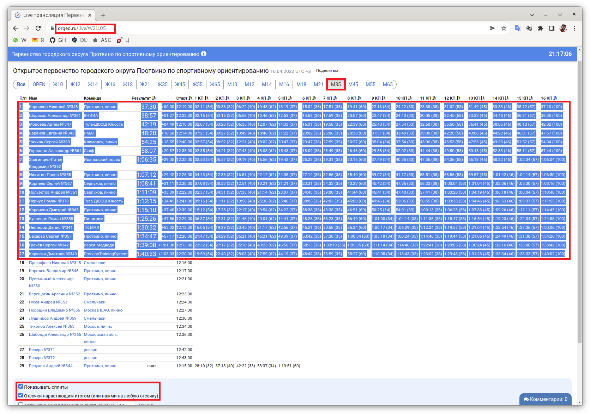

# "Паровозы" в спортивном ориентировании [@orient_togethers_bot](https://t.me/orient_togethers_bot)

Поиск "паровозов" на соревнованиях по спортивному ориентированию

1. Скопируйте таблицу результатов группы без заголовка с флажками Показывать сплиты и Отсечки нарастающим итогом с сайта https://orgeo.ru/
2. Вставьте в текстовый файл с любым именем
3. Удалите лишние КП
4. Сохраните файл и отправьте его боту

Бот вернёт список "паровозов" с перечислением порядковых номеров КП, либо сообщит об их отсутствии

**Алгоритм поиска «паровозов»**
1. Для каждого спортсмена вычислить абсолютное время посещения всех КП с учётом абсолютного времени старта и временных интервалов посещения КП из сплита с отсечками нарастающим итогом.
2. Для всех пар спортсменов вычислить список КП в которых они встретились в пределах 30 секунд.
3. Выбрать пары спортсменов, которые встретились более чем на трёх КП.
4. Отсортировать пары в порядке убывания числа встреч на КП.
5. В каждой паре «паровозит» тот, кто в большем числе встреч на КП отмечался позже. КП, на которых тот, кто «паровозит» отмечался раньше того, за кем он «паровозит», пометить знаком «-». При одинаковом числе КП с «-» и без «-» считать, что «паровозит» тот, кто занял место хуже в своей группе.
6. Если тот, кто «паровозит», ранее не был добавлен в результирующий список с большим числом встреч на КП, то добавить пару спортсменов и список порядковых номеров КП со встречами в результирующий список.

**Команды бота**

* /ping - проверка отклика бота
* /help - как пользоваться этим ботом?

**Разработчик**
Павел Никитин @nikitinpa